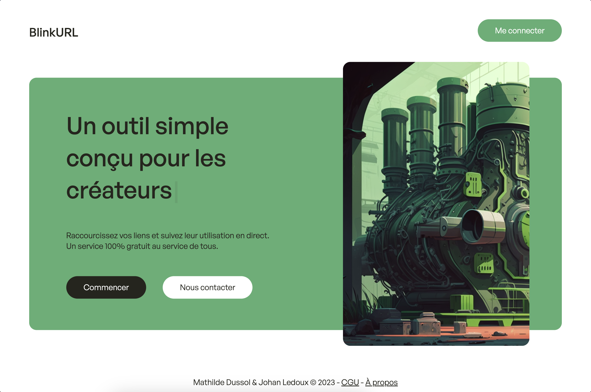
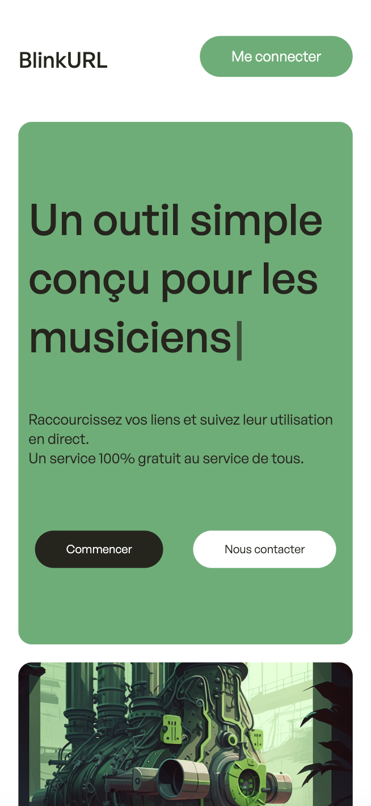
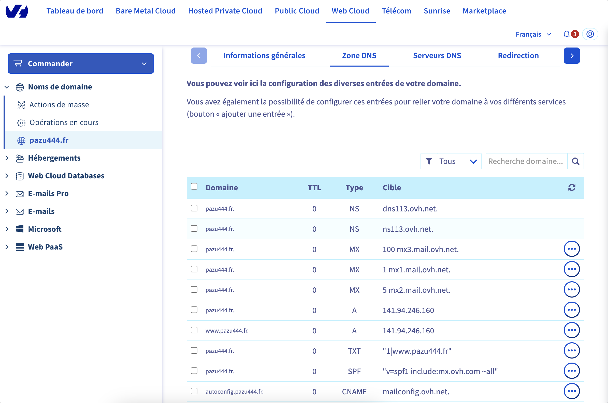
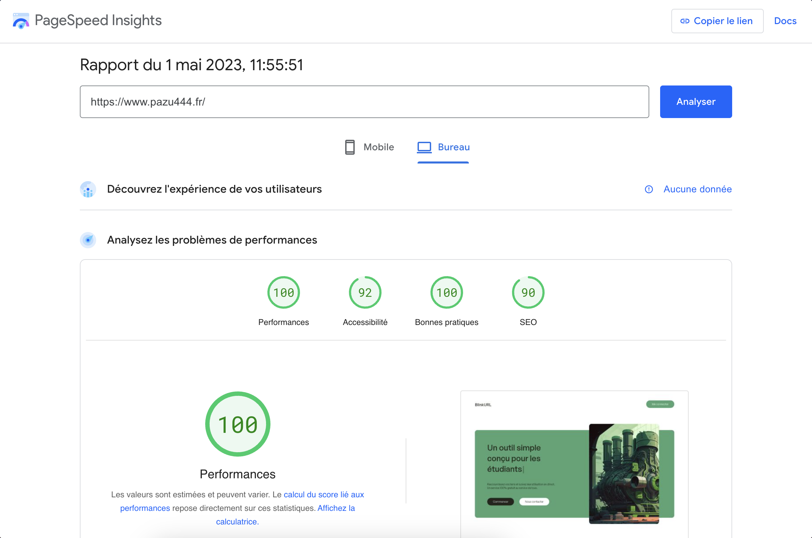
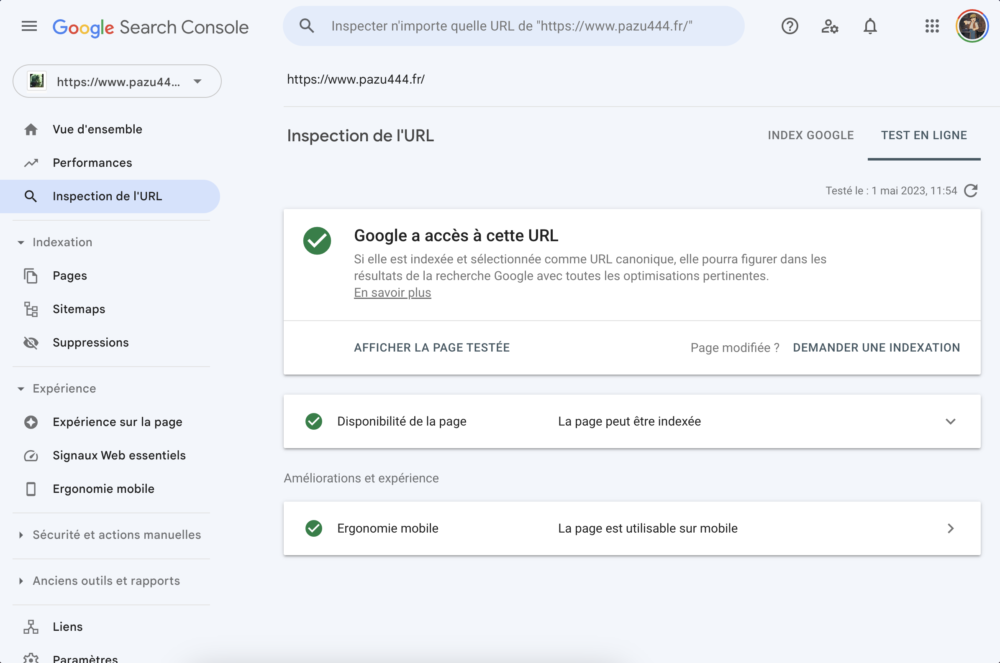

 

# BlinkURL

<a href='https://www.pazu444.fr/'>BlinkURL<a/> est un site web développé dans le cadre de mon projet de fin d'année de Terminale en spécialité NSI. Il s'agit d'un site web de raccourissemnt d'URLs développé avec Django.

 

## Le projet

Le projet est développé avec plusieurs technologies. Le font-end utilise du HTML, CSS et du Javascript sans framworks CSS. Le back-end est développé en Django. 
La partie serveur utilise Nginx et Gunicorn sur un VPS de chez OVH.

Vous pouvez découvir le projet et son élaboration grâce au <a href='rapport_de_projet.pdf'>rapport de projet</a> disponible sur Github directement.

## Liens externes et documentations

- <a href='https://www.djangoproject.com/' target='_blank'>Django</a> (framework back-end Python)
- <a href='https://www.nginx.com/' target='_blank'>Nginx</a> (serveur web)
- <a href='https://gunicorn.org/' target='_blank'>Gnicorn</a> (serveur HTTP Python)
- <a href='https://www.ovhcloud.com/fr/vps/' target='_blank'>VPS</a> (STARTER chez OVH) 
- <a href='https://www.ovhcloud.com/fr/domains/' target='_blank'>Nom de domaine</a> (chez OVH) 
- <a href='https://www.midjourney.com/home/?callbackUrl=%2Fapp%2F' target='_blank'>Midjouney</a> (génération de l'illustration) 
- <a href='https://openai.com/' target='_blank'>ChatGPT</a> (génération de texte, aides divers) 

## Documents annexes

Zone DNS configuré chez OVH :

 

Performances du site web :

 

Google Search Console :

 
